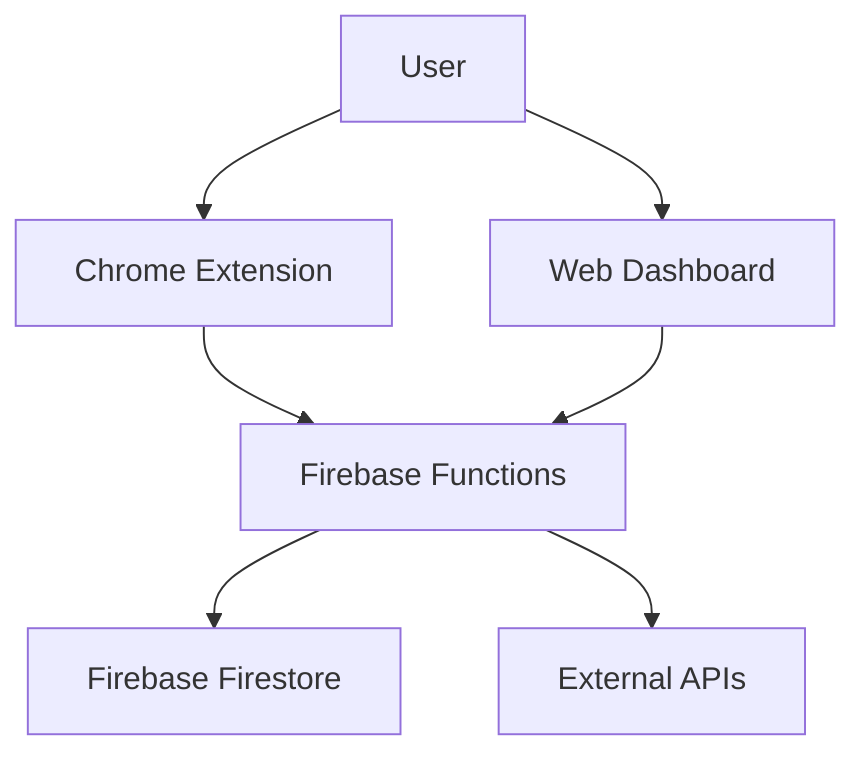

# AIV Systems - AI Validation Platform

AIV (AI Validation) System is a comprehensive solution for validating AI responses in real-time across multiple platforms. This repository contains a Chrome extension, web dashboard, Firebase backend services, and extensive documentation.

## Components

### Chrome Extension
- Real-time capture of AI chat interactions across multiple platforms
- Advanced validation algorithms for response accuracy
- Integration with AIV System backend for comprehensive validation
- Supports ChatGPT, Gemini, Groq, Claude, and Copilot
- Privacy-focused design with local processing options

### Web Dashboard
- React-based dashboard with authentication (Firebase Auth)
- Real-time visualization of validation results
- Interactive components for managing validation logs
- Responsive design with Tailwind CSS
- Analytics and insights with Recharts

### Backend Services
- Firebase Functions for serverless backend processing
- Firestore for data storage and retrieval
- REST API endpoints for validation requests
- CORS support for cross-origin requests
- Scalable architecture for handling multiple validation requests

## Getting Started

### Prerequisites
- Node.js (v14 or higher)
- npm (v6 or higher)
- Firebase account for backend services
- API keys for AI services (OpenAI, Google Gemini, etc.)

### For Validation (With Backend Services)
1. Set up Firebase project and configure Firestore
2. Deploy backend functions from the `functions/` directory
3. Install Chrome extension from `chrome-extension/dist/`
4. Configure API keys in `.env` file for web dashboard
5. Run web dashboard with `npm run dev`

### Environment variables

Create a `.env` file in the project root (copy `.env.example`) and fill in the values. Do NOT commit your `.env` file.

Required variables (examples in `.env.example`):
- VITE_FIREBASE_API_KEY
- VITE_FIREBASE_AUTH_DOMAIN
- VITE_FIREBASE_PROJECT_ID
- VITE_FIREBASE_STORAGE_BUCKET
- VITE_FIREBASE_MESSAGING_SENDER_ID
- VITE_FIREBASE_APP_ID
- VITE_GEMINI_API_KEY / VITE_OPENAI_API_KEY
- VITE_EMAILJS_SERVICE_ID
- VITE_EMAILJS_TEMPLATE_ID
- VITE_EMAILJS_PUBLIC_KEY

For local development using Vite, `.env` values will be available via `import.meta.env.VITE_*`.

### Chrome Extension: injecting runtime env

Chrome extensions may not have direct access to `import.meta.env` at runtime. Use one of the following methods to provide runtime env values to the extension:

1) Build-time injection (preferred): during your build step, replace values in a small script that sets `window.__ENV__`.

Example inline snippet to include in an extension page or background script (replace placeholders at build time):

```
<script>
	window.__ENV__ = window.__ENV__ || {};
	window.__ENV__.VITE_FIREBASE_API_KEY = "REPLACE_WITH_YOUR_API_KEY";
	window.__ENV__.VITE_FIREBASE_PROJECT_ID = "REPLACE_WITH_YOUR_PROJECT_ID";
	// ... other keys
</script>
```

2) Use the provided helper `chrome-extension/src/lib/runtime-env-inject.js` as part of your build pipeline to set `window.__ENV__` from environment variables available at build time.

After injection, the extension code uses `window.__ENV__` as a fallback to read runtime config.

### Security reminders
- Do not commit `.env` or other secret files. `.gitignore` already contains `.env*`.
- Rotate any keys that were previously exposed in source control.
- Restrict API keys in Google Cloud Console to allowed origins and APIs.


## Documentation

- [CHROME_EXTENSION_INSTALLATION.md](CHROME_EXTENSION_INSTALLATION.md) - Installation guide for Chrome extension
- [DEPLOYMENT_FREE.md](DEPLOYMENT_FREE.md) - Free deployment options
- [GETTING_STARTED.md](GETTING_STARTED.md) - Getting started guide
- [docs/project/PROJECT_SUMMARY.md](docs/project/PROJECT_SUMMARY.md) - Comprehensive project overview
- [docs/architecture/CODEBASE_STRUCTURE_INDEX.md](docs/architecture/CODEBASE_STRUCTURE_INDEX.md) - Detailed codebase structure
- [docs/project/FINAL_IMPROVEMENTS_REPORT.md](docs/project/FINAL_IMPROVEMENTS_REPORT.md) - Summary of recent improvements

## Directory Structure

The project follows an organized directory structure for better maintainability:

```
AIV System/
├── chrome-extension/             # Chrome extension source code
├── dist/                         # Built web application files
├── docs/                         # Project documentation
├── functions/                    # Firebase Functions backend
├── packages/                     # Distribution packages
├── public/                       # Static assets for web app
├── scripts/                      # Utility scripts
├── src/                          # Main web application source code
└── ...                           # Configuration files
```

For detailed information about the directory structure, see [docs/project/DIRECTORY_STRUCTURE.md](docs/project/DIRECTORY_STRUCTURE.md).

## Features

### Chrome Extension
- Advanced validation algorithms with multi-source fact checking
- Real-time monitoring of AI responses across platforms
- Historical data tracking and validation result storage
- Dashboard visualization integration
- Cross-platform support for major AI services
- Enhanced build process and packaging

### Web Dashboard
- User authentication with Firebase Auth
- Real-time validation result visualization
- Interactive log management system
- Analytics and insights dashboard
- Responsive design for all device sizes
- Comprehensive data management interface

### Backend Services
- Serverless architecture with Firebase Functions
- Scalable data storage with Firestore
- RESTful API for validation requests
- Cross-origin resource sharing support
- Secure data processing and storage

## Supported Platforms

- ChatGPT (https://chat.openai.com)
- Google Gemini (https://gemini.google.com)
- Groq (https://groq.com)
- Claude (https://claude.ai)
- Microsoft Copilot (https://copilot.microsoft.com)

## Recent Improvements

### Codebase Structure
- Improved directory organization for better maintainability
- Separation of source code and distribution files
- Component-based architecture for Chrome extension
- Centralized shared libraries and utilities

### Directory Organization
- Created organized documentation structure
- Moved distribution files to packages directory
- Organized scripts into appropriate categories
- Improved overall project organization

### Build Process
- Automated build scripts for Chrome extension and web application
- Packaging script for Chrome extension distribution
- Comprehensive build verification

### Documentation
- Enhanced documentation structure
- Comprehensive codebase indexing
- Detailed improvement reports
- Better installation and usage guides

## Building the Project

### Web Application
```bash
# Install dependencies
npm install

# Start development server
npm run dev

# Build for production
npm run build

# Preview production build
npm run preview
```

### Chrome Extension
```bash
# Navigate to extension directory
cd chrome-extension

# Install dependencies
npm install

# Build the extension
npm run build

# Watch for changes and rebuild automatically
npm run watch

# Package the extension for distribution
npm run package
```

### Build All Components
```bash
# Build both web app and extension
npm run build:all
```

## Validation Algorithms

The AIV System implements several sophisticated validation algorithms to ensure AI response accuracy:

### 1. Error Keyword Detection
- Identifies responses containing error-related keywords
- Flags potential API or processing failures

### 2. Response Length Validation
- Ensures responses meet minimum length requirements
- Prevents validation of incomplete or placeholder responses

### 3. Sensitive Information Detection
- Identifies potentially sensitive data in user queries
- Helps maintain privacy and security standards

### 4. Professional Claims Validation
- Verifies professional claims about individuals
- Cross-references information with authoritative sources

### 5. Personal Relationship Validation
- Handles personal relationship verification questions
- Recognizes when manual verification is required

### 6. Factual Accuracy Validation
- Performs web search-based fact checking
- Uses multi-source verification for improved accuracy
- Compares AI responses with information from Wikipedia and other sources

## Privacy

The AIV System processes data securely:
- Only chat content is sent for validation
- All data is processed securely

## License

This project is licensed under the MIT License - see the LICENSE file for details.

## Technology Stack

### Frontend
- React 19 with Vite
- Tailwind CSS for styling
- React Router for navigation
- Recharts for data visualization
- Lucide React for icons

### Backend
- Firebase Functions (Node.js)
- Firebase Firestore for database
- Firebase Authentication

### Chrome Extension
- Vanilla JavaScript
- Manifest V3
- Content scripts for DOM manipulation
- Background scripts for processing

### APIs and Services
- Google Gemini API
- Wikipedia API for fact checking
- EmailJS for contact forms

## Project Architecture

### High-Level Architecture


### Data Flow
1. **Capture**: Chrome extension content script monitors DOM for AI chat interactions
2. **Process**: Background script receives captured interactions and sends to validation service
3. **Validate**: Validation service performs multi-source fact checking using external APIs
4. **Store**: Results are sent to Firebase Functions backend for storage in Firestore
5. **Display**: Web dashboard retrieves and displays validation results

### Component Architecture
- **Chrome Extension**: Captures and validates AI responses in real-time
- **Web Dashboard**: Provides visualization and management interface
- **Backend Services**: Handles validation logic and data storage
- **Validation Algorithms**: Implements sophisticated validation techniques

## Development Setup

### Initial Setup
1. Clone the repository
2. Install dependencies for the main project:
   ```bash
   npm install
   ```
3. Install dependencies for the Chrome extension:
   ```bash
   cd chrome-extension
   npm install
   cd ..
   ```
4. Install dependencies for the Firebase functions:
   ```bash
   cd functions
   npm install
   cd ..
   ```

### Environment Configuration
1. Copy `.env.example` to `.env` in the root directory
2. Fill in the required environment variables
3. For Chrome extension, ensure runtime environment variables are injected during build

### Running the Development Servers
1. Start the main web application:
   ```bash
   npm run dev
   ```
2. Build and load the Chrome extension:
   ```bash
   cd chrome-extension
   npm run build
   ```
   Then load the `chrome-extension/dist` directory in Chrome extensions

### Code Structure
- `src/` - Main web application source code
- `chrome-extension/` - Chrome extension source code
- `functions/` - Firebase Functions backend
- `docs/` - Project documentation

## Conclusion

The AIV Systems platform provides a comprehensive solution for validating AI responses across multiple platforms. With its robust architecture, sophisticated validation algorithms, and user-friendly interfaces, it offers developers and users a powerful tool for ensuring the accuracy and reliability of AI-generated content.

Whether you're a developer looking to integrate AI validation into your workflow or a user seeking to verify AI responses, AIV Systems provides the tools and capabilities needed to build trust in AI technologies.
