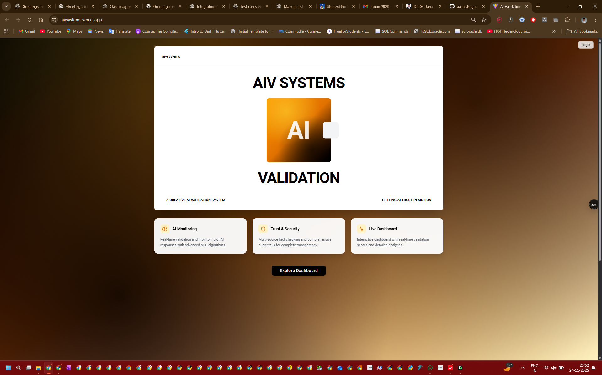

# AIV Systems Chrome Extension

## Overview
The AIV Systems Chrome Extension provides real-time validation of AI chatbot responses across multiple platforms including ChatGPT, Gemini, Groq, Claude, and Copilot.

## Extension Preview


## Features
- Real-time monitoring of AI responses
- Validation of response accuracy
- Cross-platform support
- Privacy-focused design options
- Integration with AIV Systems dashboard

## Directory Structure
```
chrome-extension/
├── dist/                         # Built extension files for distribution
├── src/                          # Source code
│   ├── components/               # Reusable UI components
│   │   ├── background/           # Background script components
│   │   ├── content/              # Content script components
│   │   ├── popup/                # Popup UI components
│   │   └── shared/               # Shared components between parts
│   ├── content/                  # Content scripts for AI platform integration
│   ├── core/                     # Core extension files (manifest, package.json)
│   ├── lib/                      # Shared libraries and utilities
│   ├── assets/                   # Static assets (icons, images)
│   └── utils/                    # Utility functions
├── docs/                         # Extension documentation
└── tests/                        # Extension test files
```

## Installation

### Development Installation
1. Clone the repository
2. Navigate to the `chrome-extension` directory
3. Run `npm install` to install dependencies
4. Open Chrome and go to `chrome://extensions/`
5. Enable "Developer mode"
6. Click "Load unpacked" and select the `chrome-extension/dist` directory

### Production Installation
1. Download the latest release package
2. Extract the ZIP file
3. Open Chrome and go to `chrome://extensions/`
4. Enable "Developer mode"
5. Click "Load unpacked" and select the extracted directory

## Building the Extension
```bash
# Build the extension
npm run build

# Watch for changes and rebuild automatically
npm run watch

# Package the extension for distribution
npm run package
```

## Supported Platforms
- ChatGPT (https://chat.openai.com)
- ChatGPT (https://chatgpt.com)
- Google Gemini (https://gemini.google.com)
- Groq (https://groq.com)
- Anthropic Claude (https://claude.ai)
- Microsoft Copilot (https://copilot.microsoft.com)

## Architecture

### Content Scripts
Content scripts run on supported AI platforms and capture user interactions. They monitor for new responses and send them to the background script for validation.

### Background Script
The background script handles communication between content scripts and the validation service. It manages the validation process and stores results.

### Popup UI
The popup provides a user interface to view validation results and control extension settings.

### Validation Service
The validation service communicates with the AIV Systems backend to validate AI responses using advanced algorithms.

## Development

### Prerequisites
- Node.js (v14 or higher)
- npm (v6 or higher)

### Setup
```bash
cd chrome-extension
npm install
```

### Building
```bash
# Build once
npm run build

# Watch for changes
npm run watch
```

### Testing
```bash
# Run tests (if available)
npm test
```

## Configuration
The extension can be configured through the popup interface. Settings are stored in Chrome's local storage.

## Troubleshooting
If you encounter issues with the extension:

1. Ensure you're using a supported AI platform
2. Check that the extension has necessary permissions
3. Verify that the AIV Systems backend is accessible
4. Check the browser console for error messages

## Contributing
Contributions are welcome! Please read our contributing guidelines before submitting pull requests.

## License
This project is licensed under the MIT License - see the LICENSE file for details.

## Support
For support, please open an issue on the GitHub repository or contact the development team.