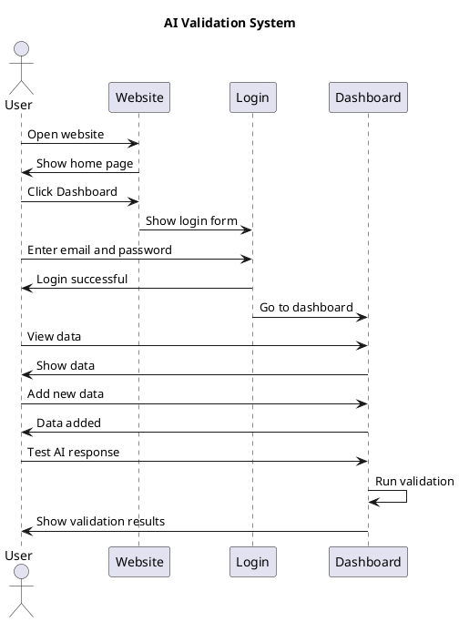
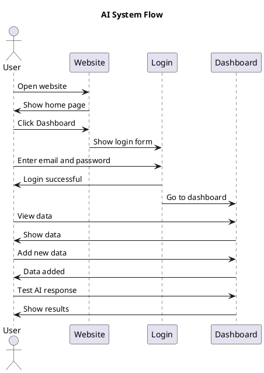

# Fixed Sequence Diagram for PlantText

## Working Version (Copy this to PlantText.com)

## Alternative Simple Version

## How to Use:

1. Go to [PlantText.com](https://www.planttext.com/)
2. Copy the code above (without the markdown backticks)
3. Paste it in the editor
4. The diagram should work now!

## What I Fixed:

- Removed the diagram name after @startuml
- Made sure all syntax is correct
- Simplified the participant names
- Fixed the structure

Try the first version - it should work perfectly now!
