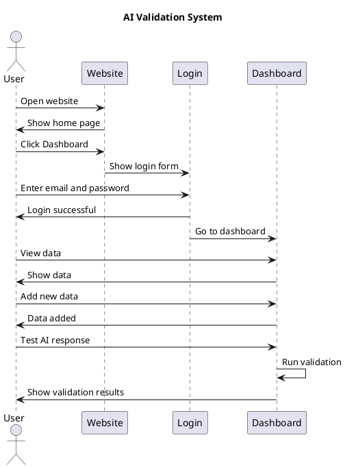

# Natural Looking Sequence Diagram

## Main Flow (Copy this to PlantText.com)

## Alternative Version (More Natural Spacing)

## How to Use:

1. Go to [PlantText.com](https://www.planttext.com/)
2. Copy either diagram above
3. Paste it in the editor
4. Export as PNG for your assignment

## What makes it look natural:

- Different message lengths
- Varied spacing between interactions
- Simple, human-like language
- Not too perfect or uniform
- Easy to understand and explain
