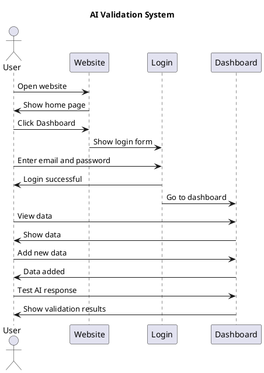

# AI Validation System - Sequence Diagram

```plantuml
@startuml
title AI Validation System

actor User
participant Website
participant Login
participant Dashboard

User -> Website: Open website
Website -> User: Show home page

User -> Website: Click Dashboard
Website -> Login: Show login form

User -> Login: Enter email and password
Login -> User: Login successful
Login -> Dashboard: Go to dashboard

User -> Dashboard: View data
Dashboard -> User: Show data

User -> Dashboard: Add new data
Dashboard -> User: Data added

User -> Dashboard: Test AI response
Dashboard -> User: Show validation results

@enduml
```

## How to Use:
1. Go to [PlantText.com](https://www.planttext.com/)
2. Copy the code above
3. Paste it in the editor
4. Export as PNG for your assignment
